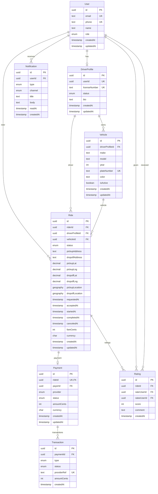

# Entity Relationship Diagram (ERD)

## Notes

- `Ride.pickupLocation`/`dropoffLocation` are PostGIS `geography(Point,4326)` columns (nullable) used to support geospatial queries (e.g., `ST_DWithin`).
- UUIDs are generated using `pgcrypto` (`gen_random_uuid()`).
